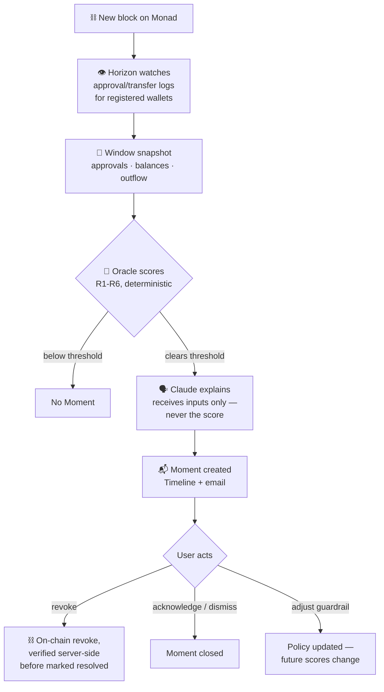

# Meridian

**The chain is too fast for second thoughts. Meridian is your second thought, running before you sign.**


On Monad, blocks finalize in about a second. That's the pitch and the problem: there's no mempool-length pause to notice a phishing approval, a drainer contract, or a wallet quietly bleeding out through a recurring transfer. By the time a human would normally react, the block that matters is already final.

A dashboard that only tells you what already happened doesn't fix that — the mistake is already on-chain by the time it fires. Meridian's first line is **Guard**: paste any contract or spender address and get a real verdict, from the same deterministic signals the rest of the app uses, *before* you ever sign anything. No wallet connection required — it works for a decision you haven't made yet, not an event that already landed.

For the wallet you actually register, Meridian keeps working after that: it **watches** every registered wallet in real time, **scores** what it sees against a deterministic rules engine — no LLM anywhere in the scoring path — and **protects**, in increasing commitment: an email that explains what happened, a one-tap on-chain revoke, or a spend-cap vault where an over-cap spend is timelocked regardless of what you signed, warning or not.

## How it works

| Component | Role |
|---|---|
| **Guard** | Pre-sign check. Scores any contract/spender address against age, verification, and allowlist signals — before an approval, not after. No wallet connection needed. |
| **Horizon** | Watcher. A WebSocket worker that subscribes to new blocks on Monad, tracks registered wallets' approvals, transfers, and balances, and writes periodic snapshots. |
| **Oracle** | Regret engine. A deterministic rules engine (R1–R6) scores each snapshot; Claude narrates the score in plain language but never computes or sees it. |
| **Keel** | Protection. Notify (email), Confirm (one-tap on-chain revoke), and Hold (a spend-cap smart contract, unaudited first draft, targeting Monad testnet). |
| **Meridian** | The product surface: Timeline, Guardrails, and Moment views. |

## How a Moment gets made

Guard's flow is deliberately simpler than this and isn't pictured separately: address in → age/verification/allowlist lookup → verdict + explanation out, synchronously, with no wallet, no Horizon, and no stored state involved. The diagram below is the other path — what happens once a wallet is actually registered and being watched.



## What it does

### 🛡️ Guard — check before you sign

- `GET /api/guard?address=&chainId=` (also usable directly from the dashboard, no wallet connection needed) scores any contract or spender address on the same signals R1/R6 use to score an approval after the fact — contract age (RPC-only `eth_getCode` binary search), source verification (Etherscan V2), and Meridian's own allowlist — but answers a different question: *should I approve this*, not *what already happened*.
- Verdict bands are tuned for that different question, not a raw reuse of R1's formula: allowlisted is always **safe**; not allowlisted and either young (under 14 days) or unverified is **danger**; not allowlisted but established and verified is **caution**. R1's raw score always adds its not-allowlisted bonus once you're off the allowlist, which would collapse caution and danger into the same band — age and verification are the signals that actually distinguish "not vetted yet" from "actively looks like a drainer."
- The explanation is Claude, same restraint-oriented output shape as a Moment's, but with its own system prompt enforcing forward-looking tense (*approving this would be worth hesitating over*, never *this approval is...*) — reusing the Moment prompt as-is would describe an approval that hasn't happened yet as if it already had.
- This is the one part of the product that works for literally anyone, on any dApp, with zero wallet connection, zero gas, and zero registration. Reactive monitoring can only ever cover a wallet you've registered; Guard covers a decision you're about to make anywhere.

> **Honest limit:** Guard is advisory. It stops a bad signature from happening only if you check first and heed the verdict — nothing on-chain enforces it. Hold tier (below) is where the actual, un-skippable enforcement lives, for whatever you've chosen to put behind it.

### 👁️ Horizon — the watcher

- WebSocket worker subscribing to new Monad blocks; tracks approvals, transfers, and balances for every registered wallet, windowed into periodic snapshots (default: every ~50 blocks / 30s flush)
- Recurring-payment detection (R3) needs discrete transfer history the snapshots alone don't have — a dedicated `transfers` table backs a running-average pattern matcher (±10% amount tolerance, ±20% interval tolerance between occurrences)
- Contract-age and source-verification enrichment for newly-touched contracts: deployment block via RPC-only `eth_getCode` binary search (no third-party API dependency), verification status via Etherscan's V2 multichain API (serves monadscan.com) — feeds R1's young-contract bonus and R4 directly
- Runs on a long-lived process (Railway); WebSocket subscriptions don't fit Vercel's serverless model, so a cron-triggered sweep endpoint (`/api/horizon/sweep`) backfills any gap

> **Caveat:** age/verification lookups degrade to "unknown" — never a guessed penalty or pass — when an archive-capable RPC or an Etherscan key isn't available. Native MON transfers emit no logs, so R3's recurring-payment detection is ERC-20 only today.

### 🧮 Oracle — the regret engine

Six deterministic rules, pure functions, no LLM in the scoring path:

| Rule | Detects | Status |
|---|---|---|
| **R1** | Risky/unlimited approvals to unverified or freshly-deployed contracts | Live, including the young-contract bonus |
| **R2** | Velocity spikes (USD-normalized via a CoinGecko-backed price cache) | Live on mainnet only — no real market to price testnet tokens against |
| **R3** | Recurring payments trending upward, unacknowledged | Live, ERC-20 only |
| **R4** | First-touch contracts (young + unverified) | Live; the value-ratio bonus stays 0 — needs raw call-data value tracking Horizon doesn't do yet |
| **R5** | Balance floor breaches | Detects actual breaches; the 7-day projected-breach forecast isn't computed yet |
| **R6** | NFT collection-wide approvals (`setApprovalForAll`) to unverified or freshly-deployed operators | Live; watches ApprovalForAll only — a single-token ERC-721 approval is bounded risk and out of scope for v1 |

Claude narrates the score in plain language. It receives only raw rule inputs — never the numeric score itself — and cannot compute or influence a Moment's risk. Output is structured and constrained to a two-part, restraint-oriented format: explain the risk, don't manufacture urgency.

A daily per-wallet Moment cap (default 10, across all rules combined) exists specifically against alarm fatigue — the fastest way to make a safety product get ignored is to page someone ten times a day.

### ⚓ Keel — protection, by tier

- **Notify** (shipped) — email via Resend on every Moment, skipped for wallets without a notification email set
- **Confirm** (shipped) — one-tap revocation from the Timeline for R1 (`approve(spender, 0)`) and R6 (`setApprovalForAll(operator, false)`) Moments. The revoke is independently verified by fetching and decoding the transaction on-chain before the Moment is marked resolved; a client's claim of "I revoked it" is never trusted on its own
- **Hold** (`MeridianKeel.sol`, unaudited first draft) — an opt-in, user-funded daily spend-cap vault for native MON. Spends within cap execute instantly; spends over cap, and any increase to the cap itself, are timelocked 24 hours and cancelable. Emergency withdrawal is always available but delayed 12 hours, and the request itself triggers an email alert — the delay plus visibility is the drainer-resistance mechanic. The owner has no path to user funds; owner powers are limited to pausing new deposits and updating a published, informational-only allowlist pointer

> **Status:** first draft, 44 deterministic tests plus a 256,000-call fuzzed invariant suite (fund conservation holds across every randomized sequence the fuzzer's tried so far), 100% branch coverage — not the same thing as an audit. **Deployed to Monad testnet only** (see Deployed contracts below); mainnet is on the Roadmap, gated on a public self-audit — spec thread → invariant tests thread → self-audit findings thread — happening for real, not compressed to hit a deadline. See [`contracts/README.md`](./contracts/README.md).

### 📊 Timeline & Guardrails

- **Timeline** — chronological feed of Moments, newest first, with an explicit all-clear state when there's nothing to show
- **Guardrails** — per-rule tier and threshold configuration, per wallet
- Wallet registration derives the address from the caller's verified SIWE identity, never from client input — there's no path to registering a wallet you don't control

## Deployed contracts

| Network | Address |
|---|---|
| Monad testnet (chain 10143) | [`0xA72664323B63E837048120C9F9b801bDBCf5176a`](https://testnet.monadscan.com/address/0xA72664323B63E837048120C9F9b801bDBCf5176a) |
| Monad mainnet (chain 143) | Not yet — on the Roadmap, gated on the self-audit actually happening, not on a deadline |

Deploy flow is keystore-based, never a plaintext key — see [`contracts/README.md`](./contracts/README.md).

## Security model

- **Row Level Security on every user-scoped table** (`wallets`, `snapshots`, `moments`, `policies`, `patterns`, `transfers`, `sync_state`) — only service-role clients (Horizon, Oracle) bypass it. `allowlist` is the one deliberate exception: it's readable by anon too (migration `0007`), because it's public reference data and Guard has to work before anyone signs in
- **Wallet ownership is cryptographic, not claimed** — registration derives the address from the caller's verified SIWE identity, never from client input
- **Score and LLM are firewalled from each other** — Claude receives raw rule inputs and returns plain-language text; it cannot see, compute, or influence a Moment's numeric score
- **On-chain actions are independently verified** — approval revocations are confirmed by fetching and decoding the transaction from-chain before a Moment is marked resolved
- **Internal-only routes** (`/api/oracle/explain`, `/api/horizon/sweep`) require a shared secret compared with `crypto.timingSafeEqual`
- **Chain-scoped caches** — the allowlist and price cache are keyed by `(address, chain_id)` / `(key, chain_id)`, not by address alone, since the same address can be an unrelated contract on a different network
- **Security headers** (CSP, HSTS, X-Frame-Options, Permissions-Policy) set on every response
- **`npm audit` clean** — dependency overrides pin several transitive packages to patched versions
- **`MeridianKeel.sol`** follows checks-effects-interactions throughout, with a reentrancy guard shared across every fund-moving function and no owner path to user funds. First draft, not an audited contract — see [`contracts/README.md`](./contracts/README.md) for exactly what has and hasn't been verified

**Test suite:** 79/79 passing (`npm test`) across Horizon window processing, pattern detection, pricing, Guard, and Oracle's scoring/explanation layer. `MeridianKeel.sol`: 44/44 deterministic (`forge test`) plus a fuzzed invariant suite (256,000 calls, fund conservation holds throughout), 100% branch coverage.

**Known limitations:** no IP/token-bucket rate limiting yet (only a per-user wallet cap); R4's contract-age lookup needs an archive-capable RPC to be reliable.

## Stack

- **App:** Next.js 16 (App Router), TypeScript, Tailwind CSS — deployed on Vercel
- **Chain:** wagmi + viem, custom wallet-connect UI (MetaMask, WalletConnect)
- **Contracts:** Solidity, Foundry (`contracts/`)
- **Data:** Supabase (Postgres, Auth, Row Level Security)
- **Worker:** Node.js WebSocket listener (Horizon) — deployed on Railway
- **LLM:** Anthropic API (Claude Sonnet 5), explanations only
- **Pricing:** CoinGecko API
- **Explorer data:** Etherscan V2 multichain API (serves monadscan.com)
- **Email:** Resend

## Repo layout

```
src/
  app/                Next.js routes (pages + API)
    timeline/          Timeline screen
    guardrails/         Guardrails screen
    api/                 API routes, incl. guard/ — the pre-sign check
  components/          UI components (Guard, MomentCard, RevokeButton, ...)
  lib/
    horizon/             Block-window processing, decimals, outflow calc,
                          recurring-payment detection, contract-age/
                          verification lookups
    oracle/              Rules engine, explanation layer, Moment pipeline,
                          guard.ts (pre-sign verdict logic)
    pricing/             CoinGecko price cache
    notifications/       Resend email
    supabase/            Client factories (browser, user-scoped, service role)
worker/                 Horizon worker entrypoint (Railway)
contracts/              MeridianKeel.sol (Foundry) — Hold tier, deployed to Monad testnet, unaudited
scripts/                One-off scripts (allowlist seeding)
supabase/migrations/    SQL migrations
```

## Running locally

```bash
npm install
cp .env.example .env.local   # see Environment variables below
npx supabase init
npx supabase link --project-ref <your-project-ref>
npx supabase db push
npm run seed:allowlist       # pulls Monad protocol addresses into the allowlist
npm run dev
npm run worker               # separate process — needs a WebSocket RPC endpoint
```

Enable the Web3 Wallet (Ethereum) provider under Supabase Dashboard → Authentication → Providers.

Contracts:

```bash
cd contracts
forge build
forge test
forge coverage --report summary
```

To deploy (Monad testnet — keystore-based, never a plaintext private key; mainnet is on the Roadmap, gated on the self-audit):

```bash
cd contracts
cp .env.example .env
cast wallet import meridian-deployer --interactive
forge script script/DeployMeridianKeel.s.sol --rpc-url monad_testnet --broadcast --account meridian-deployer --verify
```

See [`contracts/README.md`](./contracts/README.md) for the full deploy/verify flow.

## Environment variables

See `.env.example` for the full list with defaults. Grouped by area:

| Area | Variables |
|---|---|
| Supabase | `NEXT_PUBLIC_SUPABASE_URL`, `NEXT_PUBLIC_SUPABASE_ANON_KEY`, `SUPABASE_SERVICE_ROLE_KEY` |
| Wallet connect | `NEXT_PUBLIC_WALLETCONNECT_PROJECT_ID` |
| Monad RPC | `NEXT_PUBLIC_MONAD_RPC_URL`, `NEXT_PUBLIC_MONAD_TESTNET_RPC_URL` (+ explorer URLs) |
| Horizon worker | `HORIZON_CHAIN_ID`, `HORIZON_WS_RPC_URL`, `MERIDIAN_APP_URL`, `ORACLE_EXPLAIN_SECRET`, `SUPABASE_SERVICE_ROLE_KEY` |
| Cron fallback | `HORIZON_SWEEP_SECRET` |
| Oracle / Claude | `ANTHROPIC_API_KEY`, `ORACLE_EXPLAIN_SECRET`, `ORACLE_DAILY_MOMENT_CAP` |
| Price cache | `COINGECKO_API_KEY` (optional — raises CoinGecko rate limits) |
| Explorer verification | `ETHERSCAN_API_KEY` (optional — without it, R4's verification signal is "unknown," never "unverified") |
| Notifications | `RESEND_API_KEY`, `RESEND_FROM_EMAIL` |

## API routes

| Route | Purpose |
|---|---|
| `GET /api/guard?address=&chainId=` | Pre-sign check for any contract/spender address — no auth, no wallet required |
| `POST /api/wallets` | Register a wallet (ownership-verified via SIWE identity) |
| `GET /api/wallets` | List the caller's registered wallets |
| `PATCH /api/wallets/:id` | Update wallet settings (e.g. notification email) |
| `GET /api/timeline?wallet=` | Fetch a wallet's Moments, newest first |
| `GET/PATCH /api/moments/:id` | Read or update a Moment's status (`acked`/`dismissed`) |
| `POST /api/moments/:id/revoke` | Verify and record an on-chain approval revocation |
| `GET/PUT /api/policies?wallet=` | Read or update guardrail configuration |
| `POST /api/oracle/explain` | Internal — Claude explanation layer |
| `POST /api/horizon/sweep` | Internal — cron-triggered backfill for the Horizon worker |

## Roadmap

### Shipped

- **✅ Guard.** Pre-sign check for any address, no wallet needed — the proactive half of the product, not just fast reactive response.
- **✅ All six Oracle rules live.** R1–R6 all produce real Moments from real signals — none are wired-but-inert.
- **✅ Confirm-tier revoke, verified on-chain, for R1 and R6.** Not client-trusted: the revoke transaction (`approve(spender, 0)` or `setApprovalForAll(operator, false)`) is fetched and decoded server-side before a Moment resolves.
- **✅ `MeridianKeel.sol` deployed to Monad testnet.** Hold tier, first draft, 44 deterministic tests plus a 256,000-call fuzzed invariant suite, 100% branch coverage — see Deployed contracts above for the live address.
- **✅ NFT approval monitoring (R6).** Watches `ApprovalForAll` (ERC-721/1155) for collection-wide operator grants — the actual drainer pattern, not a single-token approval.

### Up next

- **MeridianKeel's public self-audit**, then mainnet deployment — gated on the audit actually happening, not on a deadline.
- **Guard as a browser-extension auto-intercept** — today it's a check you run yourself; the next step is catching approval calls before the wallet's own signing popup even appears, the same pattern already shipped in Salvage's Chrome extension.
- **Telegram notifications**, alongside email.
- **Rate limiting on public API routes** — today there's only a per-user wallet cap, no IP/token-bucket layer.
- **R5's projected-breach forecast** — currently detects actual breaches only, no 7-day-ahead projection.

## Vision

Blind-signing shouldn't be the default just because a chain is fast. Meridian starts as a dashboard for Monad wallets, but the mechanism — watch, score deterministically, offer a real intervention before the mistake settles — is meant to generalize: as a widget wallets embed directly, as a policy layer other protection tooling can plug into, not just as a single site people have to remember to check.

## An honest note on protection

Meridian reduces regret; it doesn't eliminate risk, and the honest way to say that is to be specific about which parts of it actually prevent something versus which parts respond fast after the fact — they're not the same claim, and conflating them would be exactly the kind of overclaiming this section exists to avoid.

**Guard prevents, but only if you use it and heed it.** It scores an address before you approve it, which is genuinely earlier than everything else here — but it's advisory. Nothing stops you from seeing "danger" and approving anyway.

**Hold prevents structurally, but only for what you've put behind it.** An over-cap spend from the vault is timelocked and cancelable regardless of what gets signed or who talked you into it — no click-through, unlike Guard. But it only covers native MON you've proactively deposited; it doesn't reach a risky approval sitting in your normal wallet.

**Notify and Confirm are reactive, and that's fine as long as it's not confused with prevention.** A Moment only fires after Horizon has already seen the activity on-chain — it cannot stop a transaction from landing, only help you act fast afterward: revoke what's still revocable, understand what happened, adjust your guardrails for next time.

Put together: Guard is the warning before the mistake, Hold is the backstop if the warning fails or gets ignored for funds you've chosen to protect that way, and Notify/Confirm are the fast recovery layer for everything else. No dashboard replaces reading what you're about to sign — Meridian's job is to make that easier to do in time, and to limit the damage on the times it doesn't work.

---

**Built by Abu Olumi** · Security Researcher · Builder
